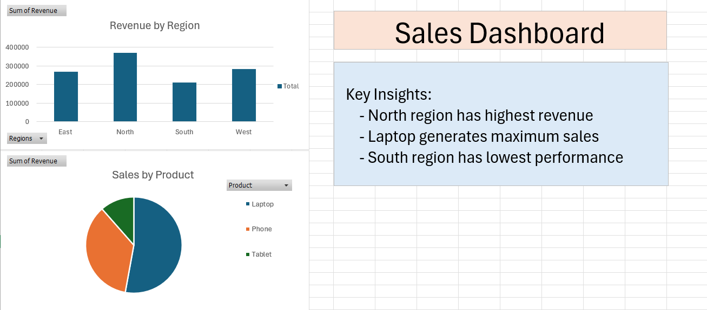

# 📊 Excel Analytics Dashboard

A data analytics project built using Microsoft Excel where I analyzed a sales dataset and created a simple dashboard to generate insights.

---

## 🚀 Features

- Pivot tables for analysis  
- Revenue by region (bar chart)  
- Product-wise sales (pie chart)  
- Basic data cleaning  
- Insights from data  

---

## 📊 Dashboard Preview

---

## 🛠️ Tools Used

- Microsoft Excel  
- Pivot Tables  
- Charts  

---

## 📌 Insights

- North region has highest revenue  
- Laptop generates maximum sales  
- South region has lowest performance  

---

## 👨‍💻 Author

Ayush Verma
